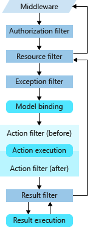

# 中间件

## 什么是中间件

通常用于处理和管理请求和响应之间的逻辑。

## 中间件管道顺序


```csharp
public class SimpleMiddleware
{
    private readonly RequestDelegate _next;

    public SimpleMiddleware(RequestDelegate next)
    {
        _next = next;
    }

    public async Task InvokeAsync(HttpContext context)
    {
        // 处理请求前的逻辑
        Console.WriteLine("Processing request...");
        
        await _next(context); // 调用下一个中间件
        
        // 处理请求后的逻辑
        Console.WriteLine("Processing response...");
    }
}

```

执行顺序:

- 请求进入SimpleMiddleware，输出“Processing request...”。
- 请求传递给控制器，控制器生成响应。
- 响应返回给SimpleMiddleware，输出“Processing response...”。
- 最终响应发送到客户端。

## ASP.NET Core 中的筛选器

在请求处理管道中的特定阶段之前或之后运行代码。

内置筛选器处理任务，例如：

- 授权（防止用户访问未获授权的资源）。
- 响应缓存（对请求管道进行短路出路，以便返回缓存的响应）。

下图展示了筛选器类型在管道中的交互方式：




更多相关资料可查阅[官方文档](https://learn.microsoft.com/zh-cn/aspnet/core/mvc/controllers/filters?view=aspnetcore-8.0)。
